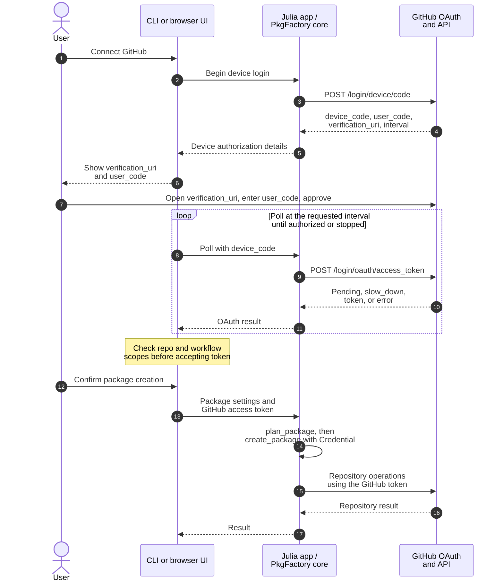
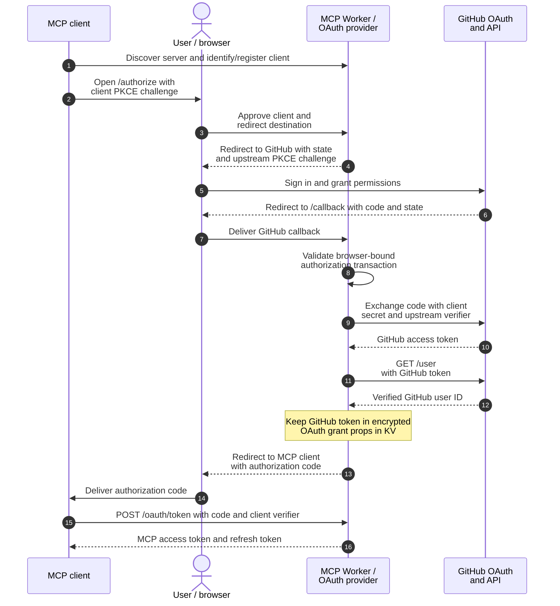
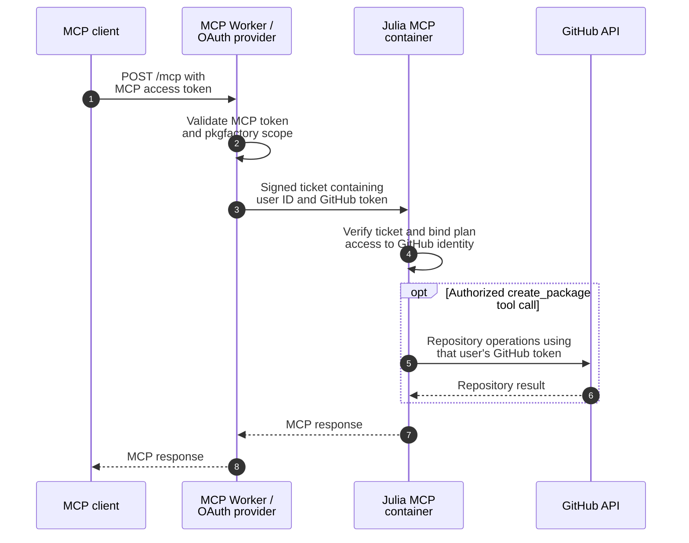

# Authentication Design

Authentication belongs to the applications; the PkgFactory core receives an
explicit `Credential` for GitHub operations. The flows below describe the
implementation in this checkout, not the deployment status of a hosted service.

## Methods and adoption

**Current** means implemented; **Planned** means not yet adopted; **-** means not
selected. The planned local interfaces use `gh`, and the planned Online Web UI
uses OAuth + PKCE. The current CLI and Web UI still use Device Flow; the
Cloudflare MCP service already implements OAuth + PKCE. The local OAuth
prototype is not adopted.

| Method | Pros | Cons | Decision |
| :--- | :--- | :--- | :--- |
| GitHub CLI (`gh`) | No manual copying; no authentication server | Requires authenticated `gh`; shared login lacks user isolation | Planned: Local CLI, Local Web UI |
| OAuth + PKCE (local callback) | No manual copying | Bundled secret is public; callback restrictions | - |
| OAuth + PKCE (HTTPS callback) | No manual copying; per-user login | Requires authentication server and secret management | Current: Cloudflare MCP; Planned: Online Web UI |
| Device Flow | No client secret or callback | Requires manual copying | Current: Local CLI, Local Web UI, hosted Web UI (including Cloudflare) |
| Personal Access Token (PAT) | No callback; supports automation | Requires manual copying and token management | Current: Local CLI, Local MCP, single-operator HTTP MCP GitHub access |

“Authentication server” means a server run by the operator. “Manual copying”
refers to app authentication codes or tokens, excluding GitHub login and MFA.

## CLI and Web UI: Device Flow

The CLI controls device login in `apps/cli/src/auth.jl`. In the Web UI, the
browser controls polling through the Julia server's `/api/oauth/device` and
`/api/oauth/token` routes. Both use the core's `device_flow_begin` and
`device_flow_poll` helpers. On Cloudflare, the Web Worker forwards these API
requests to the Web container; it does not replace Device Flow with a callback.

The user enters **`user_code`**, not `device_code`. The latter is used only for
polling. Device Flow requests `repo`, `workflow`, `read:user`, and `read:org`;
the CLI and browser reject a token missing `repo` or `workflow`. Polling waits
while authorization is pending, increases the delay on `slow_down`, and stops
on success or an error such as denial or expiry.

The browser keeps the GitHub token in its tab's memory and sends it as
`Authorization: Bearer ...` for repository operations. The Web server does not
persist it. Closing the tab clears that copy without revoking the GitHub grant.
The CLI first uses `GITHUB_TOKEN`, falling back to `GH_TOKEN` when unset; it
starts Device Flow only when no token is available. Preview needs no credential.
See [GitHub authentication](user.md#GitHub-authentication) for usage and
[Web UI Hosting](hosting.md) for deployment controls.

## Cloudflare MCP: OAuth + PKCE

The MCP Worker is the authorization server for MCP clients and a separate OAuth
client of GitHub. It uses authorization code flows with S256 PKCE on both legs,
with distinct verifiers. The client receives a PkgFactory MCP token; the user's
GitHub token stays in the service. The GitHub OAuth App client secret is held
by the Worker, and the callback is `MCP_ORIGIN/callback`.

The consent and callback handling lives in `deploy/cloudflare/mcp/oauth.js`;
`worker.js` configures the OAuth provider and forwards authenticated MCP calls.
The GitHub request asks for `repo`, `workflow`, and `read:user`, and the callback
requires `repo` and `workflow` before completing authorization. Refreshing an
MCP token rechecks the GitHub token and user ID; revoked access requires login
again.

### Authenticated MCP requests

The Worker replaces the incoming MCP Bearer token with a short-lived signed
ticket for the private container. `apps/mcp/src/cloudflare.jl` verifies it and
constructs a per-user `Credential`. Plan ownership uses the verified GitHub
identity. GitHub tokens never become tool arguments or plan records; the
ApplicationState Durable Object stores plans, results, and repository locks
separately from OAuth grants in KV. The client obtains user approval for each
creation; possession of a plan ID alone is not proof of that approval.

Service credentials have separate roles: `MCP_TICKET_SECRET` signs container
tickets, `MCP_STATE_SECRET` grants MCP state access, `WEB_STATE_SECRET` grants
only Web repository lock access, and `WEB_PROXY_SECRET` authenticates Web
gateway forwarding. `STATE_RECOVERY_SECRET` is reserved for operator recovery
and is passed to neither container. See the
[Cloudflare deployment guide](https://github.com/JuliaPackageFactory/PkgFactory.jl/blob/main/deploy/cloudflare/README.md)
for configuration and rotation.

## Other MCP launchers

Local stdio MCP uses `GITHUB_TOKEN` (or `GH_TOKEN`) from the server environment
when creation is requested. The standalone HTTP launcher requires a separate
`MCP_AUTH_TOKEN` for client access. The Render/Auth0 launcher validates an
Auth0 token and permits one configured operator subject, using a separate
server-side GitHub credential for repository operations. These MCP access
tokens are never forwarded to GitHub. See the
[MCP guide](https://github.com/JuliaPackageFactory/PkgFactory.jl/tree/main/apps/mcp)
for those launchers.
