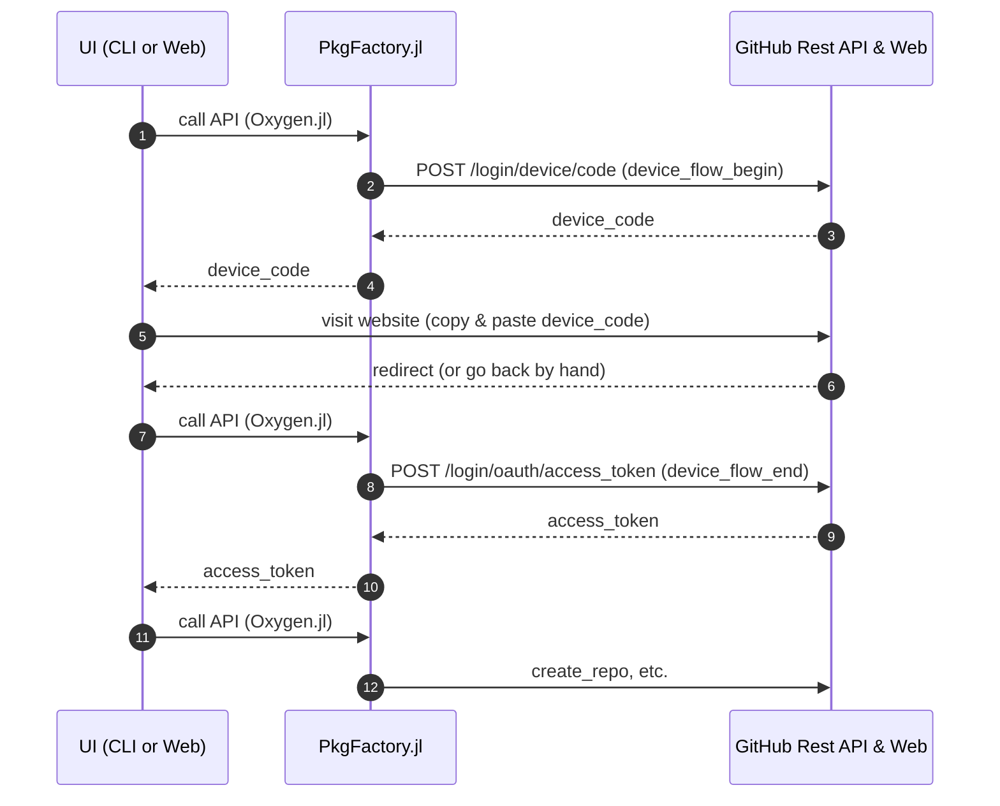

# Developer Guide

This page describes how to develop PkgFactory.jl locally (tests, docs, and common maintenance tasks). For feature requests or behavior changes, please open an Issue first to discuss motivation, use-cases, and compatibility. Once we agree on the direction, PRs are welcome.

Generate Documentation:

```sh
julia --project=docs --startup-file=no -e 'using Pkg; Pkg.develop(PackageSpec(path=pwd())); Pkg.instantiate();'
julia --project=docs --startup-file=no -e 'include("docs/make.jl")'
```

Run Tests:

```sh
julia --project=. --startup-file=no -e 'using Pkg; Pkg.test()'
```

Dependency Maintenance:

```sh
julia --project=. -e 'import Pkg; Pkg.update()'
julia --project=. -e 'import Pkg; Pkg.resolve()'
julia --project=. -e 'import Pkg; Pkg.instantiate()'
```

Development REPL (with Revise):

```sh
julia -i -E 'using Revise; import Pkg; Pkg.activate("."); using PkgFactory; PkgFactory.hello()'
```

Default tests use test doubles and temporary local Git repositories. They do not write to GitHub.

## Documentation deployment

The documentation job authenticates with `GITHUB_TOKEN` to push the versioned
site to `gh-pages`. It does not use `DOCUMENTER_KEY`, because deploy keys are
disabled for this repository. Keep GitHub Pages configured to deploy from
`gh-pages` at `/ (root)`.

Pushes authenticated with `GITHUB_TOKEN` do not automatically start a Pages
build, so the job explicitly requests one through the GitHub API after a
successful deployment and doctests. This requires `contents: write` and
`pages: write`. Pull requests build and test the docs without requesting a
Pages build.

## Template repository tests

Changes under `templates/` pushed to `main` automatically publish and test the
`Minimum`, `Simple`, and `AllInOne` templates. You can also run **Actions →
Template repositories E2E → Run workflow** on `main`. Create the three
repositories (`TemplateMinimum.jl`, `TemplateSimple.jl`, and
`TemplateAllInOne.jl`) under the same owner as PkgFactory.jl
(`JuliaPackageFactory`) before the first run. The workflow derives
`PKGFACTORY_E2E_OWNER` from `github.repository_owner`; no Actions variable is
required.
An empty repository receives its first commit; subsequent runs preserve its UUID
and history. Repositories with commits must have a matching `Project.toml` on
`main`. For the repository rename, the corresponding old package names
(`PkgFactoryMinimum`, `PkgFactorySimple`, and `PkgFactoryAllInOne`) are also
accepted; the next run updates the package name while preserving its UUID.

Set this secret under **Settings → Secrets and variables → Actions**:

| Type | Name | Value |
| :--- | :--- | :--- |
| Secret | `PKGFACTORY_E2E_TOKEN` | A fine-grained PAT with `JuliaPackageFactory` as its resource owner, limited to the three template repositories |

The PAT needs **Contents: Read and write**, **Workflows: Read and write**, and
**Metadata: Read-only**. No Administration, Secrets, or Actions permissions are
needed. This workflow does not create repositories, change repository settings,
or configure deploy keys or secrets.

The E2E script renders the templates, commits changed files, checks that the
remote received the commit, and runs each generated package's tests. Commits
record the source PkgFactory SHA; the job summary links to the changes. Files
outside the current template are retained, including files removed from a newer
template. Identical output creates no commit. Concurrent remote edits cause the
push to fail without rewriting history.

The workflow is separate from normal CI and only publishes from `main`. It does
not wait for the generated repositories' own workflows. Documentation deployment in
`TemplateSimple.jl` and `TemplateAllInOne.jl` requires a deploy key and
`DOCUMENTER_KEY`, configured separately.
Local tests exercise the publishing helper against temporary Git repositories.

OAuth Device Flow Sequence Diagram:


