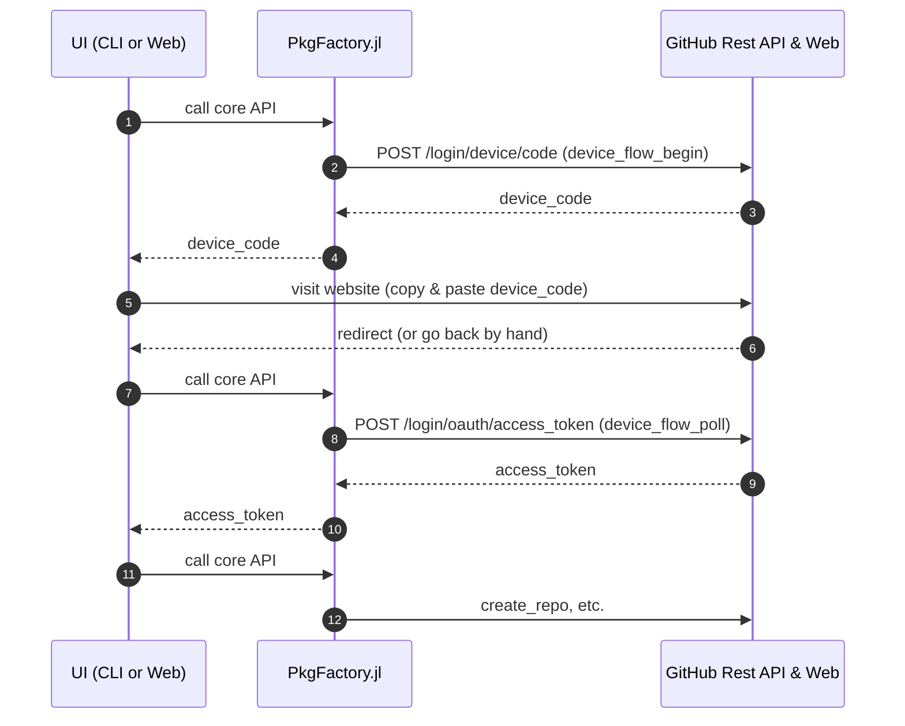

# Developer Guide

This page describes how to develop PkgFactory.jl locally (tests, docs, and common maintenance tasks). For feature requests or behavior changes, please open an Issue first to discuss motivation, use-cases, and compatibility. Once we agree on the direction, PRs are welcome.

Generate Documentation:

```sh
julia --project=docs --startup-file=no -e 'import Pkg; Pkg.instantiate()'
julia --project=docs --startup-file=no -e 'include("docs/make.jl")'
```

The core and applications require Julia 1.12+. The root workspace includes
`test` and `docs`; each application has a separate workspace containing its own
`test` project and a committed Manifest. Applications resolve the local core
through `[sources]`. They are not members of the root workspace.

For each application, run these commands with `APP` set to `cli`, `web`, or `mcp`:

```sh
julia --project=apps/APP --startup-file=no -e 'import Pkg; Pkg.instantiate()'
julia --project=apps/APP --startup-file=no -e 'import Pkg; Pkg.test()'
```
All package settings, defaults and creation behavior belong in the core. Apps
may translate input, manage authentication and present results, but must not
implement a second creation engine.

Run Tests:

```sh
julia --project=. --startup-file=no -e 'using Pkg; Pkg.test()'
```

Dependency Maintenance:

```sh
julia --project=. -e 'import Pkg; Pkg.update()'
julia --project=. -e 'import Pkg; Pkg.resolve()'
julia --project=. -e 'import Pkg; Pkg.instantiate()'
```

Development REPL:

```sh
julia --project=. --startup-file=no -i -e 'using PkgFactory'
```

Default tests use test doubles and temporary local Git repositories. They do not write to GitHub.

## Documentation deployment

The documentation job authenticates with `GITHUB_TOKEN` to push the versioned
site to `gh-pages`. It does not use `DOCUMENTER_KEY`, because deploy keys are
disabled for this repository. Keep GitHub Pages configured to deploy from
`gh-pages` at `/ (root)`.

Pushes authenticated with `GITHUB_TOKEN` do not automatically start a Pages
build, so the job explicitly requests one through the GitHub API after a
successful deployment and doctests. This requires `contents: write` and
`pages: write`. Pull requests build and test the docs without requesting a
Pages build.

## Template repository tests

Changes under `templates/` pushed to `main` automatically publish and test the
`Minimum`, `Simple`, and `AllInOne` templates. You can also run **Actions →
Template repositories E2E → Run workflow** on `main`. Create the three
repositories (`TemplateMinimum.jl`, `TemplateSimple.jl`, and
`TemplateAllInOne.jl`) under the same owner as PkgFactory.jl
(`JuliaPackageFactory`) before the first run. The workflow derives
`PKGFACTORY_E2E_OWNER` from `github.repository_owner`; no Actions variable is
required.
An empty repository receives its first commit; subsequent runs preserve its UUID
and history. Repositories with commits must have a matching `Project.toml` on
`main`. For the repository rename, the corresponding old package names
(`PkgFactoryMinimum`, `PkgFactorySimple`, and `PkgFactoryAllInOne`) are also
accepted; the next run updates the package name while preserving its UUID.

Set this secret under **Settings → Secrets and variables → Actions**:

| Type | Name | Value |
| :--- | :--- | :--- |
| Secret | `PKGFACTORY_E2E_TOKEN` | A fine-grained PAT with `JuliaPackageFactory` as its resource owner, limited to the three template repositories |

The PAT needs **Contents: Read and write**, **Workflows: Read and write**, and
**Metadata: Read-only**. No Administration, Secrets, or Actions permissions are
needed. This workflow does not create repositories, change repository settings,
or configure deploy keys or secrets.

The E2E script renders the templates, commits changed files, checks that the
remote received the commit, and runs each generated package's tests. Commits
record the source PkgFactory SHA; the job summary links to the changes. These
dedicated repositories are complete generated snapshots: tracked files absent
from the current template are removed, including old package names and deleted
workflows. Do not maintain custom files in these repositories. The package UUID
and Git history are preserved. Identical output creates no commit. Concurrent remote edits cause the
push to fail without rewriting history.

The workflow is separate from normal CI and only publishes from `main`. It does
not wait for the generated repositories' own workflows. Documentation deployment in
`TemplateSimple.jl` and `TemplateAllInOne.jl` requires a deploy key and
`DOCUMENTER_KEY`, configured separately.
Local tests exercise the publishing helper against temporary Git repositories.

Simple and AllInOne upload coverage using GitHub OIDC. No `CODECOV_TOKEN` secret
is needed in the template repositories. Sign in to Codecov and give its GitHub
App access to both repositories. Coverage is uploaded by their own CI workflows;
the PkgFactory E2E workflow does not upload coverage on their behalf.

OAuth Device Flow Sequence Diagram:



## Template design choices

All three templates use Julia 1.12+ workspaces and declare their sample API with
`public`. The minimum template keeps a single CI job using the `min` selector;
simple and all-in-one also test stable and prerelease Julia. All-in-one adds a
Windows PR job and runs quality checks through the package test suite, with
dedicated Aqua and JET workflows for their status badges. Docs and
doctests run together, including for fork PRs; Documenter decides whether it can
deploy. Local builds use `.html` links.

All-in-one uses Dependabot for Julia and Actions dependencies. Do not add a
second dependency-update bot for the same projects. Simple and all-in-one use
TagBot with the `DOCUMENTER_KEY` secret for registered releases. Simple leaves
dependency-update automation to its maintainers; minimum also leaves release
automation to its maintainers.

Keep the presets small and usable without choosing organization policies. A code
of conduct and security policy need real reporting contacts and maintainer
commitments; generated placeholders would misrepresent those commitments. Logos
and favicons should belong to the new package. External-link checks, dependency
lower-bound checks, invalidation monitoring, precompilation workloads, and an
alternative test runner can be added when the package has code that benefits
from them. The greeting example does not justify enabling those extra jobs or
dependencies by default.

The `.gitignore` differences are intentional: only documentation templates need
`docs/build/`, and only all-in-one includes notebooks. Shared line-ending and
editor settings are consistent across presets. A base/overlay system, selectable
features, alternate Julia compatibility layouts, and an update-answers format
need a separate design with a supported update/migration contract. The existing
`.pkgfactory.json` is a repository-creation recovery marker, not an update file.
